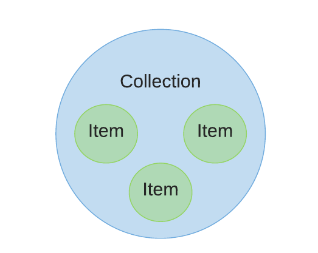
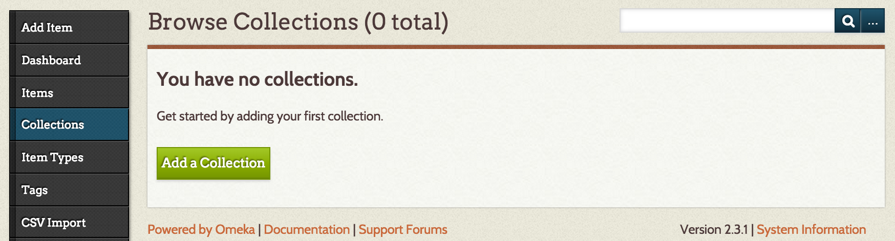
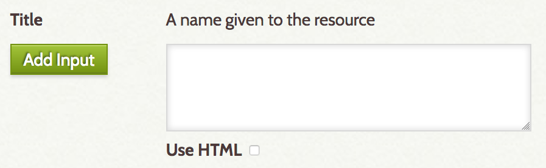
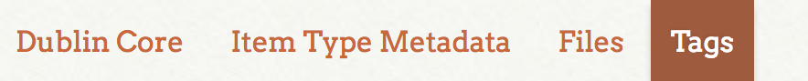

Video tutorials: [http://bit.ly/omeka-videos-2017](http://bit.ly/omeka-videos-2017)

## What is Omeka?

Omeka ([http://omeka.org/](http://omeka.org/)) is a web content management system for scholars, museums, archives, and enthusiasts. It enables its users to structure information about physical or virtual people, places, things; to express relationships between these objects; to curate public digital archives; and to develop public digital exhibits.

## Omeka's Data Structure

Omeka's archival structure is made up of Items (objects) organized into Collections (groups of objects).

Collections and Items are described in an organized, consistent, extensible way using the Dublin Core metadata standard ([http://dublincore.org/](http://dublincore.org/)).[^1]

1.  Before we begin adding Collections and Items to an Omeka archive, we'll want to **take time to consider our data structure** by answering the following questions:
    1.  **What are our Items?** How many are there? What kinds of metadata do we have about them?
    1.  **How will we organize our Items?** What kinds of parameters will we use to separate our Items into Collections? _Consider theme, geographic region, time period, typology, etc._
    1.  **Which Dublin Core fields** will we use to describe our Collections and our Items? Which formats will we use for recording dates, place names, etc.? Identify a consistent way of describing your metadata for each field.

    _**Record your data structure choices** in project notes that you keep outside of Omeka. Create spreadsheets of your archival data (one for Items, one for Collections) using 	Dublin Core terms as column headers in preparation for entering your data into Omeka._

1.  **Use a spreadsheet to organize your data** before you move it into Omeka: each Item should have its own row while Dublin Core fields should be divided into columns.

## Omeka's Interface

Omeka is entirely web-based. To fully take advantage of its [free tools](https://omeka.org/), users need space on a server to host their Omeka site. Services such as [Reclaim Hosting](https://reclaimhosting.com/) and [AcuGIS](https://www.acugis.com/) make this possible. Scholars may also wish to seek server support from their individual institution. Hosting locally on a single device or on a virtual machine is also possible.

It's also possible to host an Omeka site via [omeka.net](https://www.omeka.net/), the hosting service Omeka offers. (Note, however, the pricing scheme and available tools.)

Editing an Omeka site takes place in a web browser with user access via a Dashboard area.

### Beginning an Omeka Archive

1.  You should have received an account activation email prior to the workshop. Check your Junk/Spam folder if you do not see it in your Inbox. Follow the email's instructions to confirm your account.
1.  Navigate to [http://romanspectacle.trinity.duke.edu/admin](http://wired.dukedh.org/nhc_omeka/admin) to login.
1.  You will be redirected to the workshop's Omeka dashboard.
1.  Look at the left menu in your browser window. Here we can access locations for creating Collections and Items.
1.  The Collections and Items sections provide areas for users to add and edit Dublin Core metadata. The data entry forms for both are formatted the same:

1.  Navigate to "Items", and click "Add an Item" to view the form.
1.  Navigate to "Collections", click "Add a Collection", and view the form. Note the similarities between the "Items" and "Collections" forms: _how are they used differently?_
1.  Before continuing, note the _top_ menu. In this area, you will find controls for adjusting your user settings, settings and appearance of the website, and plugin configurations.

    _For this workshop, you have been given Admin permissions. Once you are familiar with how to add content, explore the settings in this top menu, which control the site's design and functionality. Exercise your powers wisely & ask questions often._

### Adding Collections & Items {#adding-collections-&-items}

1.  Once you have decided on a data structure, begin your Omeka archive by creating a Collection. Navigate in the left menu to "Collections", and click "Add a Collection".

1.  Enter your metadata in the appropriate Dublin Core fields.
1.  When you have finished adding metadata and are ready to make your Collection publicly available, check the "Public" box at the top right of the Add Collection page. (You may also do this later.) 
1.  Click "Add Collection" to save and publish your Collection.
1.  You will be redirected to the Browse Collections page. Now your Collection is listed in a newly created table. Note that your collection is empty: Total Number of Items is listed as 0.

1.  Let's add Items to your Collection. We can create Items individually by following the instructions below _or _we can add multiple Items at once following [this tutorial](https://docs.google.com/document/d/1iHm5b-dswu0_ZjeAALaHwQbNDvtIhh1JaJFZ3zbxABs/edit?usp=sharing), which explains how to import data from a spreadsheet. _You will receive a print copy as well._
1.  **To continue by adding 1 Item at a time:** navigate to "Items" in the lefthand menu. Click "Add an Item" to fill out the Dublin Core for one Item.

1.  Note that it is possible to **add multiple entries to a single Dublin Core field** by clicking the "Add Input" button below a Dublin Core field. 
1.  **To add links, images, and embed interactive media** in a Dublin Core field, check the "Use HTML" box below a Dublin Core field.

1.  At the top of the "Add an Item" page, note the red tabs. _You may see some or all of these tabs in your tutorial site._

1.  **Click "Files" to learn how to upload viewable images, documents, audio, or video. _You can upload other file types as well, but these will only be available for download_**. **A single Item may have multiple Files attached**. This workshop's Omeka site allows for file sizes up to 128 MB.
1.  Click "Choose File", browse your computer, and locate the file you'd like to upload.

1.  If you wish to add a second file, click "Add Another File", and browse for that file.

	_Note that your files are not uploaded until you publish your Item._

1.  In the top right box, check "Public" if you wish to make your Item publicly available, and choose the Collection into which you would like to place the Item. Click "Add Item" to publish your Item _and_ to upload your file(s).

### Using Tags to Link Items {#using-tags-to-link-items}

It is possible to use Tags — individual words or phrases — to categorize Items thematically _outside_ of the Collections structure. When viewers click on Tags on individual Item pages, they will see a list of all Items sharing those tags regardless of Collection. It is also possible to search Omeka by Tag keywords.

    _To ensure consistency, consider developing a tag reference guide outside of Omeka. This way you and your collaborators know which tags should be used. For example, define what kinds of information are being used for tags, which language you are using if working on a multilingual project, or whether you are using abbreviations or full names of organizations._

1.  In an Item's Edit page, click the "Tags" tab.

1.  Add single or multi-word tags separated by commas. Click "Add Tags" and save your Item to publish your tags.

1.  When you add the same tag(s) to another Item, Omeka will provide them as suggestions in a dropdown menu as you type.
1.  View, edit, and delete tags in the "Tags" Dashboard page. (Button in the left menu.)

### Embedding Interactive Media

To embed interactive media in an Item or Collection:

1.  Below the "Relation" field, check the box labeled "Use HTML":

1.  A rich text menu will appear above your page's textbox. Locate the HTML button. Click on it to open an HTML editing window.

1.  Paste an embed code (`<iframe>`) into the window. (Or add your own HTML and inline CSS here!)

1.  Click "Update" to Save your Item or Collection.

## Selected Examples

*   Baroque Italian Art (Fall 2016): [http://baroque.trinity.duke.edu](http://baroque.trinity.duke.edu)
*   Getty Kouros: [https://arthistorykmg.omeka.net/](https://arthistorykmg.omeka.net/)
*   Quattro Centro: [http://quattrocentoitalia.artinterp.org/omeka/](http://quattrocentoitalia.artinterp.org/omeka/)
*   Documenting the Gilded Age: [http://gildedage.omeka.net/](http://gildedage.omeka.net/)

<!-- Footnotes themselves at the bottom. -->
## Notes

[^1]:
     Metadata is carefully categorized information about an object such as its discovery date, geographic origin, creator, format, or owner. A metadata standard is a widely accepted set of terms used to categorize metadata. Using a standard ensures that a wide range of archival collections could be extended and/or combined. (Indeed, Omeka makes this possible.)

<!-- GD2md-html version 1.0β11 -->
<!----- Conversion time: 1.904 seconds.

Using this Markdown file:

1. Cut and paste this output into your source file.
2. See the notes and action items below regarding this conversion run.
3. Check the rendered output (headings, lists, code blocks, tables) for proper
   formatting and use a linkchecker before you publish this page.

Conversion notes:

* GD2md-html version 1.0β11
* Wed Jul 25 2018 10:41:01 GMT-0700 (PDT)
* Source doc: https://docs.google.com/open?id=1kufh1so0Ug_5ILs2g-spp5BaGlVPQdhUsMdfHicmXpg
----->
